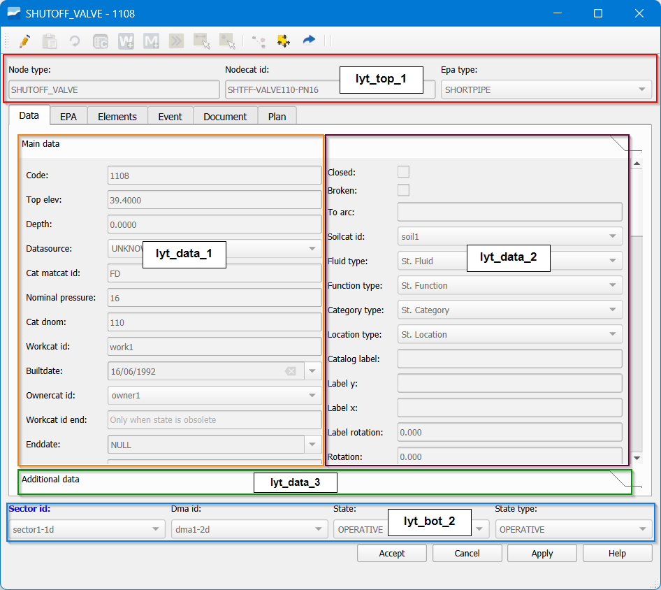

.. _config-form-fields:

=============================
Form fields configuration
=============================

Normally, there must be records for all the fields of the elements found in the *cat_feature* table 
(they must also match the *child* views that we have created in our schema).
Then, in the **config_form_fields** table, we will have for each child view a number of rows that matches all the 
fields that this view has, in order to configure them one by one.
Of the many columns in config_form_fields, each and every one is described to achieve the desired level of 
configuration:

The only rows that should be manipulated to customize the forms of the elements are those where the 
formname column has the prefix:

- ve_node_*
- ve_arc_*
- ve_connec_*
- ve_gully_*

**Position**

- tabname: to manage the forms of the different network elements, widgets are managed according to the pestaña (tab) where they are located.
There are different tabs, and each will have the corresponding name: data, element, document, etc.

There are two types of tabs, distinguished by the layout arrangement. Most have one or two layouts, but those in the feature_info have all 3 vertical layouts (except the tab data).
When there are values in *config_form_fields* that refer to a form without tabs, the value for this column will be: **main**.

- layoutname: each tab contains three layouts (1,2,3), the name of each layout follows the structure lyt_tabname_(1,2,3). Additionally, we have the layouts lyt_top_1, lyt_bot_1 (top row), lyt_bot_2 (bottom row).

- layoutorder: is the order of the field within its corresponding layout. They will be arranged in ascending order using the value they have in this field. Two fields with the same layoutname and layout_order values will overlap in the form.

    Positioning of the different widgets.

**Basic characteristics**

- Datatype: data type. Does not apply to combo-type elements. Possible values are: ``string``, ``double``, ``date``, ``bytea``, ``boolean``, ``text``, ``integer``, ``numeric``.

- Widgettype: type of widget. Possible values are: ``datetime``, ``label``, ``nowidget``, ``text``, ``image``, ``typeahead``, ``button``, ``check``, ``combo``, ``hyperlink``, ``divider``, ``list``, ``spinbox``, ``hspacer``, ``tableview``, ``multiple_checkbox``, ``multiple_option``.

- label: field label in the form and the attribute table. Fully customizable.

- hidden: true / false, shown / not shown in the form and the attribute table.

- tooltip: text displayed when hovering over the field label. Fully customizable.

- placeholder: example value to display when the field is empty.

- iseditable: true / false. The field can / cannot be edited in the form and the attribute table.

- ismandatory: if true, this field must have a value.

- isparent: true / false. When a widget is the parent of another, it allows reloading combos of the children that have identified this widget as their parent (dv_parent_id).

- isautoupdate: true / false. Triggers the form update without waiting for the user's ok. Valid for fields where recalculations are needed, such as depths or others. This option is not available for typeahead widgets.

- isfilter: true / false. When we have a list-type widget, it can be filtered by widgets located in the same tab. These widgets can be any, but must have the attribute isfilter=true. Of special interest for them are the keys ``vdefault`` y ``listFilterSign`` de widgetcontrols.

**Management of value domains (combo and typeahead)**

The management of value domains for combo and typeahead widgets is controlled through several fields:

- dv_querytext: contains the SQL query that returns two logical columns, id and idval; in the particular case of typeahead, both must correspond to the same field.

- dv_orderby_id: indicates whether the ordering should be done by id instead of by idval.

- dv_isnullvalue: allows the list to accept null values.

- dv_parent_id: indicates the widget that acts as parent.

- dv_querytext_filterc: adds additional filtering conditions depending on the value of the parent.

**Advanced characteristics**

**stylesheet**: json-type field that allows graphical customization of the label. See FAQS for examples of this field.

**widgetcontrols**:  allow advanced control of the widget with the following options:

    *autoupdateReloadFields*: immediately reloads other fields if one is modified. It acts in combination with isautoupdate.

    .. code-block:: sql

       UPDATE config_form_fields SET widgettype = 'combo', isreload=true, widgetcontrols =
       gw_fct_json_object_set_key(widgetcontrols, 'autoupdateReloadFields', '["cat_matcat_id",
       "cat_dnom", "cat_pnom"]'::json) WHERE column_id IN ('arccat_id', 'nodecat_id', 'connecat_id')

    *enableWhenParent*: enables a combo only if the parent field has certain values.

    .. code-block:: sql

       UPDATE config_form_fields SET widgetcontrols = gw_fct_json_object_set_key
       (widgetcontrols,'enableWhenParent','[1, 2]'::json) WHERE column_id IN ('state_type')

    *regexpControl*: control of what the user can write using a regular expression in free-text widgets.
    
    .. code-block:: sql

       UPDATE config_form_fields SET hidden=false, datatype='text', widgetcontrols =
       gw_fct_json_object_set_key(widgetcontrols,'regexpControl','[\\d]+:[0-5][0-9]:[0-5][0-9]'::text)
       WHERE column_id = 'observ'
    
    .. note::
         Since the character ``\\`` is reserved by the system for PostgreSQL, the update must be done with ``\\\\`` so that two appear in the row, so that the stored syntax and the one that will be used will be 
         ``[\\d]+:[0-5][0-9]:[0-5][0-9]``

    *maxMinValues*: sets a maximum value for numeric fields in free-text widgets.

    .. code-block:: sql

       UPDATE config_form_fields SET widgetcontrols = gw_fct_json_object_set_key
       (widgetcontrols,'maxMinValues','{"min":0.001, "max":100}'::json) WHERE column_id = 'descript'

    *setMultiline*: enables multiline fields for writing with enter.
    
    *spinboxDecimals*: sets a specific number of decimals for the spinbox widget (vdef 2).

    .. code-block:: sql

       UPDATE config_form_fields SET widgetcontrols = gw_fct_json_object_set_key(widgetcontrols, 'spinboxDecimals', '3') WHERE column_id = 'descript'

    *widgetdim*: dimensions for the widget.
    
    *vdefault _value*: default value of the widget. It makes sense for those widgets that do not belong to feature data, since the default values are defined in those that 
    the user already has established in config_param_user. Of special interest for filter widgets.

    *vdefault_querytext*: default value of the widget based on the result of the query. It makes sense for those widgets that do not belong to feature data, since the default values are 
    defined in those that the user already has established in config_param_user. Of special interest for filter widgets.
    
    *listFilterSign*: sign (LIKE, ILIKE, =, >, < ) for filter-type fields. If omitted, 
    ILIKE will be used for tableview-type lists e = for tab-type lists.

    *skipSave Value*: if this value is defined as true, the changes made in
    the corresponding widget will not be saved. By default it is not necessary to set anything because true is assumed.
    
    *labelPosition*: if this value is defined [top, left, none], the label will occupy the relative position 
    with respect to the widget. By default left is assumed. If the label field is empty, labelPosition is omitted.

**widgetfunction**: the name of the Python function that will be executed is defined, and if present, the characteristics of the additional parameters. The file to be used can be defined with the key
``module``,  by default the file core/utils/tools_backend_calls.py.  To use a file
different from tools_backend_calls.py it must be imported in tools_gw.py.

.. code-block:: json

   {"functionName":"add_document","module":"info", "parameters":{"sourcewidget", "targetwidget"}}

**linkedobject**:

    *widgettype list*: name of the list located in the table config_form_list to be linked.
    In this table the query to be used (querytext) and the client with which it will be 
    called are configured. There are two fields in the table that currently have no associated code:

        listtype: refers to how the list is displayed: tab (elements vertically for a narrow tab) or in attributetable (elements in tableview for a larger width)

        listclass: class of elements shown in the list (icon, gallery-type icons or list).
    
    It is recommended that lists have the name list_* in the definition of the table where they are created.

    *widgettype image*: name of the image located in the table sys_image to be linked.
    It is recommended that images have the name img_*
    
    *widgettype [text/check/combo/typeahead]*: action (optional) linked with the widget (getcatalog for example) que se encuentre disponible en el diálogo, configurada en config_form_tabs. that is available in the dialog, configured in config_form_tabs.
    It is recommended that actions have the name action_*
    
    *widgettype button*: name of an icon (optional) to set on the button with the associated image located in the plugin folder icons/backend/20x20. It is recommended that
    icon names are simple numbers.png.

