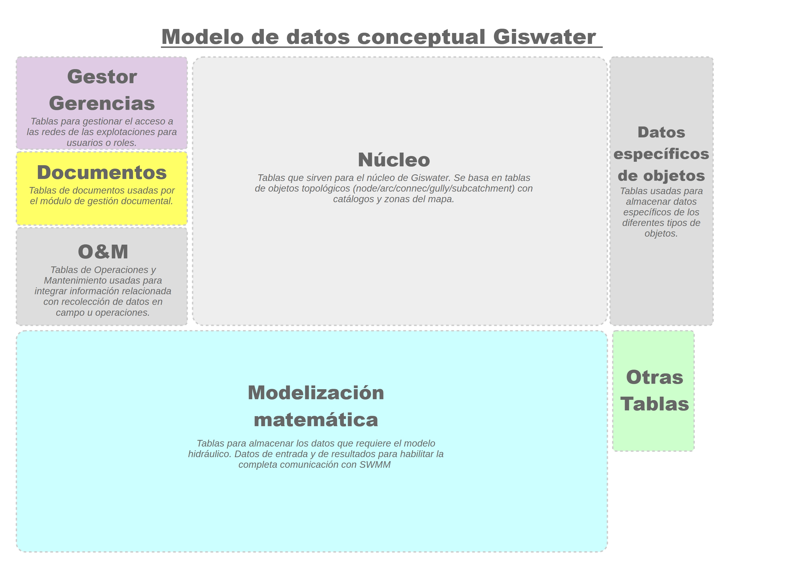
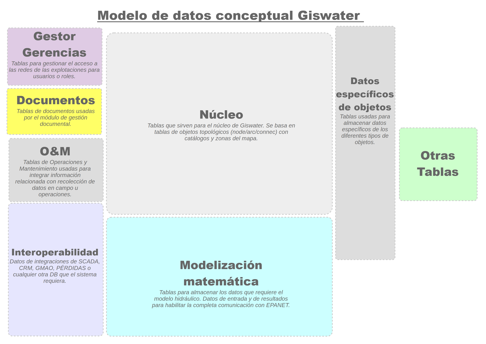

===============
Logic Dbmodel
===============

**WS**

The following image shows the conceptual data model of Giswater, organized into several functional blocks:
at the center is the Core, composed of the essential tables that define the topological objects (node/arc/connec), 
catalogs, and map zones; around this core are the other components such as *Gestor Gerencias*, which contains tables 
for managing access and permissions; *Documents*, for document management; *O&M*, which integrates operations and 
maintenance information; *Interoperability*, intended to connect Giswater with external systems such as SCADA, CRM, or CMMS; *Mathematical Modeling*, tables that store data required for hydraulic models and EPANET results; *Object-specific Data*, 
which contains particular attributes according to each element type; and a final block of *Other tables* for additional information.

    Conceptual data model of Giswater for WS.

**UD**

The data model for UD projects is similar to that for WS; in the *Core* all tables that
define the topological objects (node/arc/connec/gully/subcatchment) are grouped, incorporating in this case two additional elements: gully and subcatchment.
Unlike WS, UD projects do not include the interoperability module.

    Conceptual data model of Giswater for UD.

